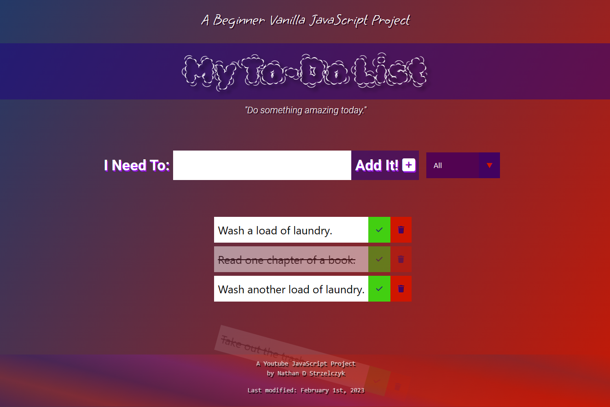

###### js-beginner-project-to-do-list

<h1 align="center"><a href="https://www.youtube.com/watch?v=Ttf3CEsEwMQ">Beginner Javascript Project: To-Do List</h1></a>

Completed with last year's skills. Updated with some from this year.

- Added Features:
   - A truly colorful footer.
   - A last-modified date display on the footer courtesy of some JavaScript.

  
   
  Picture: My Completed Beginner Javascript Project: To-Do List

